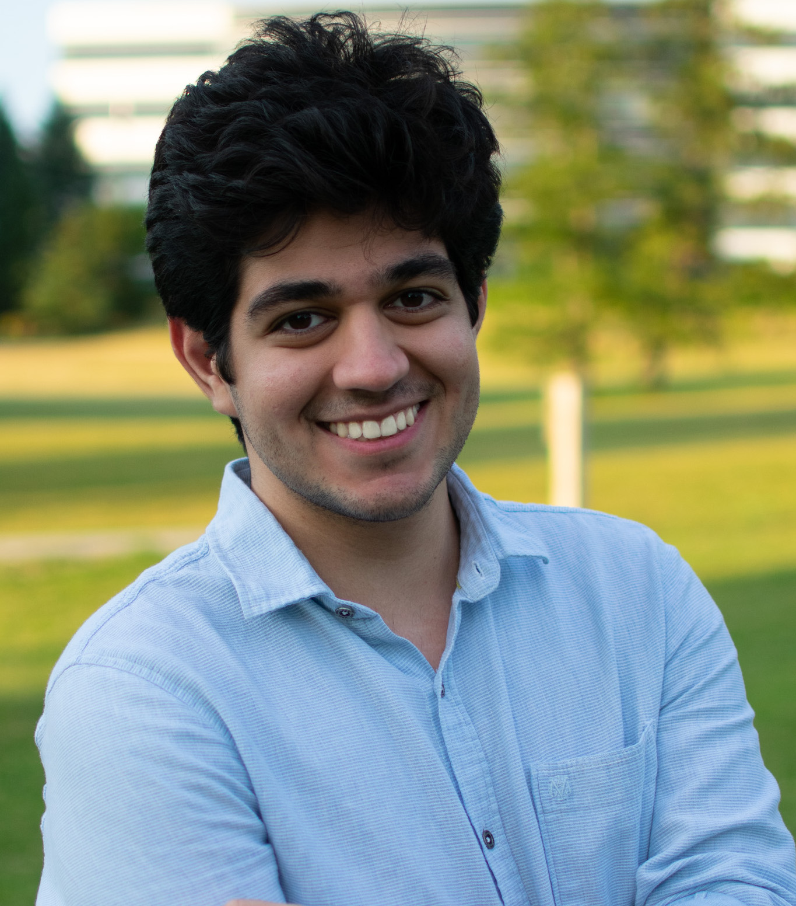

{.headshot}

I am a PhD student at MIT, working under the supervision of [Ankur Moitra](https://people.csail.mit.edu/moitra/). I studied my master's in the [algorithms and complexity group](https://algcomp.uwaterloo.ca/) at the University of Waterloo where I was fortunate to be advised by [Gautam Kamath](http://www.gautamkamath.com/).

[Google Scholar](https://scholar.google.com/citations?hl=en&user=Jnei_lEAAAAJ) / 
[DBLP](https://dblp.org/pid/307/5441.html) /
[arXiv](https://arxiv.org/a/majid_m_1.html) / 
[Github](https://github.com/Mahbodmajid) / [Twitter](https://twitter.com/mahbodm_)

### publications

**Sample-Optimal Private Regression in Polynomial Time**
 
*Prashanti Anderson, Ainesh Bakshi, Mahbod Majid, Stefan Tiegel.*
 
STOC 2025. [arxiv](https://arxiv.org/abs/2503.24321)

**On the Consistent Recovery of Joint Distributions from Conditionals**
 
*Mahbod Majid\*, Rattana Pukdee\*, Vishwajeet Agrawal\*, Burak Varıcı, Pradeep Kumar Ravikumar.*
 
AISTATS 2025.

**Private Mean Estimation with Person-Level Differential Privacy**
 
*Sushant Agarwal, Gautam Kamath, Mahbod Majid, Argyris Mouzakis, Rose Silver, Jonathan Ullman.*
 
SODA 2025. [arxiv](https://arxiv.org/abs/2405.20405)

**Sample-Efficient Private Learning of Mixtures of Gaussians**
 
*Hassan Ashtiani, Mahbod Majid, Shyam Narayanan*
 
NeurIPS 2024 **(Spotlight Presentation)** [arxiv](https://arxiv.org/abs/2411.02298)

**Robustness Implies Privacy in Statistical Estimation.**
 
*Samuel B. Hopkins, Gautam Kamath, Mahbod Majid, Shyam Narayanan.*
 
STOC 2023. [arxiv](https://arxiv.org/abs/2212.05015)
 
Presented at TPDP 2023 **(Oral Presentation)**.

**Efficient Mean Estimation with Pure Differential Privacy via a Sum-of-Squares Exponential Mechanism.**
 
*Samuel B. Hopkins, Gautam Kamath, Mahbod Majid.* 
 
STOC 2022. [arxiv](https://arxiv.org/abs/2111.12981) [video](https://youtu.be/GY0tCArubAg)
 
Presented at FORC 2022, non-archival track.
 
Presented at TPDP 2022.

<!-- ### talks

**UC Berkeley**, BLISS seminar, November 2022

**Fields Institute**, workshop *Differential Privacy and Statistical Data Analysis*, July 2022

**Harvard University**, symposium *Foundations of Responsible Computing*, June 2022

**University of Toronto**, theory seminar, April 2022

**Microsoft Research**, colloquium, February 2022

**University of Waterloo**, student seminar, November 2021 -->

### contact
*mahbod at mit.edu*
